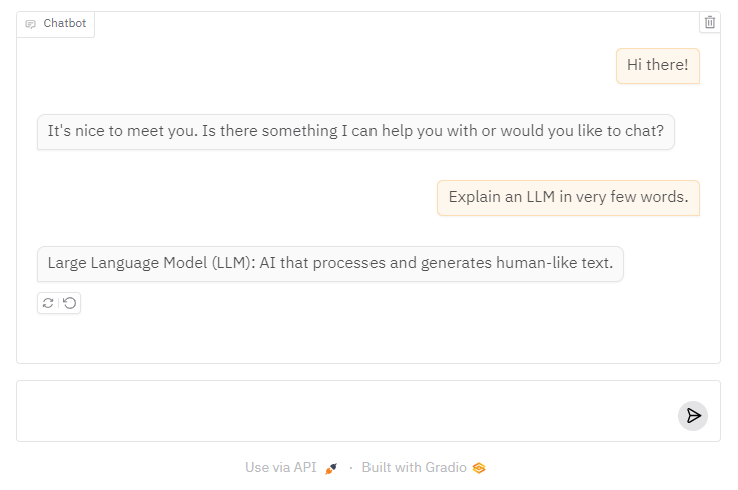

# `sambanova_gradio`

is a Python package that makes it very easy for developers to create machine learning apps that are powered by sambanova's Inference API.

# Installation

1. Clone this repo: `git clone git@github.com:gradio-app/sambanova-gradio.git`
2. Navigate into the folder that you cloned this repo into: `cd sambanova-gradio`
3. Install this package: `pip install -e .`

<!-- ```bash
pip install sambanova-gradio
``` -->

That's it! 

# Basic Usage

Just like if you were to use the `sambanova` API, you should first save your sambanova API token to this environment variable:

```
export sambanova_API_TOKEN=<your token>
```

Then in a Python file, write:

```python
import gradio as gr
import sambanova_gradio

gr.load(
    name='Meta-Llama-3.1-405B-Instruct',
    src=sambanova_gradio.registry,
).launch()
```

Run the Python file, and you should see a Gradio Interface connected to the model on sambanova!



# Customization 

Once you can create a Gradio UI from a sambanova endpoint, you can customize it by setting your own input and output components, or any other arguments to `gr.Interface`. For example, the screenshot above was generated with:

```py
import gradio as gr
import sambanova_gradio

gr.load(
    name='Meta-Llama-3.1-405B-Instruct',
    src=sambanova_gradio.registry,
    title='Sambanova-Gradio Integration',
    description="Chat with Meta-Llama-3.1-405B-Instruct model.",
    examples=["What is 2+2", "How many R are there in the word Strawberry?"]
).launch()
```


# Composition

Or use your loaded Interface within larger Gradio Web UIs, e.g.

```python
import gradio as gr
import sambanova_gradio

with gr.Blocks() as demo:
    with gr.Tab("405B"):
        gr.load('Meta-Llama-3.1-405B-Instruct', src=sambanova_gradio.registry)
    with gr.Tab("70B"):
        gr.load('Meta-Llama-3.1-70B-Instruct-8k', src=sambanova_gradio.registry)

demo.launch()
```

# Under the Hood

The `sambanova-gradio` Python library has two dependencies: `openai` and `gradio`. It defines a "registry" function `sambanova_gradio.registry`, which takes in a model name and returns a Gradio app.

-------

Note: if you are getting a 401 authentication error, then the sambanova API Client is not able to get the API token from the environment variable. This happened to me as well, in which case save it in your Python session, like this:

```py
import os

os.environ["sambanova_API_TOKEN"] = ...
```
